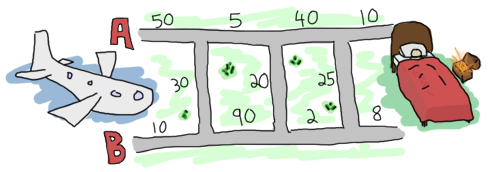
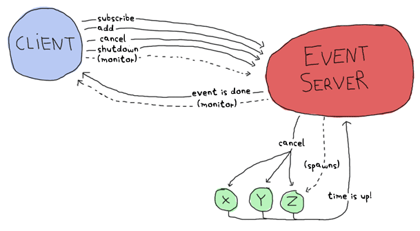

# Learn You Some Erlang

This set of notes was prepared with the version of LYSE written for Erlang version R13B+

# Contents

# Introduction

Features

- Dynamically, Strongly Typed
- Functional
    - Referential Transparency (except when it makes sense to break it, like date/time functions)
    - Declarative (concise, easier to read and maintain)
- Concurrent
    - Actor Model (message passing)
        - Every thread is only concerned with what its own sequential code
    - Thousands of concurrent processes
    - Supervision trees
- High Availability
    - Hot Reload (built for systems that need to be always available)
    - Error Recovery (let it crash philosophy)
- Development Environment
    - Bytecode Compilation (compile once, run anywhere on VM)
    - Development Tools (compiler, debugger, profiler, test framework)
    - Open Telecom Platform (web server, parser generator, key-value store)

Yes, Erlang has lightweight processes, but not everything can be solved by spamming processes. Erlang is also typically bad at things like image/signal processing (too much **number crunching** and **data moving**) and operating system drivers (too **low level**). Erlang is great for server software though.

# Starting Out

> The Erlang shell has a built-in line editor based on a subset of Emacs

Shortcuts

- `Ctrl-A` Bring cursor to beginning of line
- `Ctrl-E` Bring cursor to end of line
- `Ctrl-G` User switch command

Common Shell Functions

- `help().` help
- `q().` quit
- `f().` erase all variables
- `f(Variable).` erase variable
- `cd(Path).` change the directory (by default, shell only looks for files in the directory it was started and in the standard library)
- `c()`
- `c(Module)` compile and load specified module
- `rd(Name, Definition)` define a record
- `rr("*")` load all records
- `rr(Module)` load record definitions from specified module
- `rl()` print all record definitions
- `rl(Name)` print record definition of given name
- `rf()` unload all records
- `rf(Name)` unload specific definitions
- `rp(Term)` convert tuple to record (given the definition exists)
- `regs()` gets a list of all registered processes

Use `erl -man` to get information about modules

Information Tags

- `[async-threads:N]` Number of threads in the async thread pool, which indirectly tells us how many system calls can be spun into background threads before emulator stalls
- `[smp:X:Y]` X cores available, Y schedulers
- More information can be found in the [SO thread](https://stackoverflow.com/questions/1182025/what-do-the-erlang-emulator-info-statements-mean)

# Starting Out (for real)

## Numbers

Operators

- `/` floating-point division
- `div` integer division
- `rem` modulo operator

To express integers in non-base 10, use `Base#Value` syntax.

```erlang
1> 2#101010.
42
2> 16#AE.
174
```

`=` will bind the variable on the LHS to the value on the RHS if it is unbound, else it acts as comparison (pattern matching)

Variables must start with capital letters or `_` (to represent values you do not intend to use but want to name)

`_`, if used on its own, does not store any value and cannot be bound

## Atoms

Starts with lowercase.

Enclose in single quotes if atom does not begin with a lowercase letter or if it contains characters other than alphanumeric characters, underscore or @.

Some atoms are reserved to be function names, operators and expressions etc. and cannot be used.

Atoms are referred to in an atom table (4 bytes/atom in 32-bit system, 8 bytes/atom in 64-bit system). The table is not garbage collected and so might tip the system over from memory usage or from being full.

Atoms should not be dynamically generated and only be used by the developer

## Booleans

`true` and `false` are atoms and do not have corresponding integer values

Operators

- `and`
- `or`
- `xor`
- `not`

`and` and `or` will always evaluate both sides of the operator; use `andalso` and `orelse` to short-circuit

## Comparisons

Operators

- `=:=` equality in the manner of pattern matching (cannot equate integer value to corresponding float)
- `=/=` inequality in the manner of pattern matching
- `==` arithmetic equality
- `/=` arithmetic inequality
- `=<` <= in Erlang

Comparison between different types (e.g. number and atom) does not yield an error

`number < atom < reference < fun < port < pid < tuple < list < bit string`

## Tuples

**tagged tuple:** tuple which contains an atom with one element following it (e.g. `{celsius, 23.213}`)

## Lists

Implemented as linked lists

Can contain multiple data types

```erlang
1> [1, 2, 3, {numbers,[4,5,6]}, 5.34, atom].
[1,2,3,{numbers,[4,5,6]},5.34,atom]
```

Operations

- `++` right associative concatenation
- `--` right associative dis-concatenation
- `hd/1`
- `tl/1`
- `|` cons (constructor)

Built-in functions (BIFs) are usually functions that are defined in the implementation language (C) for speed reasons or because they cannot be implemented in pure Erlang

**improper list:** lists in the form of `[1 | 2]`. Will work in pattern matching but not in standard list functions

**proper list:** list that ends with an empty list in their last cell. Lists in the form of `[1 | [2]]` are valid as `[2]` is automatically formed in the proper manner (which is `[2|[]]`).

List comprehensions

- **generator expression**: `Pattern <- List`, can have more than one. Also serves as a filter when coupled with pattern matching (failed matches are ignored)
- `<-` same as `=` but does not throw exception

```erlang
1> [X || X <- [1,2,3,4,5,6,7,8,9,10], X rem 2 =:= 0].
[2,4,6,8,10]
```

While it may appear like Erlang's data structures are relatively limited, lists and tuples are usually enough to build other complex data structures (e.g. a binary tree node can be represented as `{node, Value, Left, Right}`)

## Strings

- Implemented as lists
- Will be printed as numbers only when at least one element cannot be represented as letter

Erlang does not have built-in string types due to its origins in telecom usage. Now, VM natively supports Unicode strings. Strings can also be stored as binary structures, making them light and fast

## Bits

Binary abstractions were necessary for the telecom applications Erlang was applied to

```erlang
1> Color = 16#F09A29.
15768105
```

Base 16 declaration

```erlang
2> Pixel = <<Color:24>>.
<<240,154,41>>
```

Binary declaration (24 bits of space)

Is the default segment 8 bits (1 byte)?

```erlang
3> Pixels = <<213,45,132,64,76,32,76,0,0,234,32,15>>.
<<213,45,132,64,76,32,76,0,0,234,32,15>>
```

12-byte binary declaration

```erlang
4> <<Pix1,Pix2,Pix3,Pix4>> = Pixels.
** exception error: no match of right hand side value <<213,45,132,64,76,32,76,
0,0,234,32,15>>
```

Pattern matching 4 variables to 12 bytes. Error as Erlang assumes a variable represents a segment.

```erlang
5> <<Pix1:24, Pix2:24, Pix3:24, Pix4:24>> = Pixels.
<<213,45,132,64,76,32,76,0,0,234,32,15>>
```

Pattern matching 4 variables to 12 bytes (explicit 24 bits per variable, or 3 segments per variable)

```erlang
6> <<R:8, G:8, B:8>> = <<Pix1:24>>.
<<213,45,132>>
```

Pattern matching 3 variables/segments to 24 bits (explicit 8 bits per variable)

```erlang
7> <<R:8, Rest/binary>> = Pixels.
<<213,45,132,64,76,32,76,0,0,234,32,15>>
```

Pattern matching with unknown length

Binary segment syntax

- `Value`
- `Value:Size`
- `Value/TypeSpecifierList`
- `Value:Size/TypeSpecifierList`

where

- `Size` bits or bytes
- `TypeSpecifierList`, comprising the following attributes separated by `-`
    - Type `integer | float | binary | bytes | bitstring | bits | utf8 | utf16 | utf32`
        - `bytes` is `binary` and `bits` is `bitstring`
        - Default `integer`
    - Signedness `signed | unsigned`
        - Only matters for matching when the type is `integer`
        - Default `unsigned`
    - Endianess `big | little | native`
        - Only matters when type is `integer`, `utf16`, `utf32` or `float`
        - `native` endianess chosen at run-time by CPU
        - Default `big`
    - Unit `unit:Integer`
        - Size of each segment, in bits
        - Allowed range 1..256 (set by default to 1 for integers, floats and bits and to 8 for binary)
        - `utf8`, `utf16` and `utf32` require no units to be defined
        - Size x Unit = number of bits the ~~segment~~ variable? will take, must be evenly divisible of 8

```erlang
10> <<X1/unsigned>> =  <<-44>>.
<<"Ô">>
11> X1.
212
12> <<X2/signed>> =  <<-44>>. 
<<"Ô">>
13> X2.
-44
14> <<X2/integer-signed-little>> =  <<-44>>.
<<"Ô">>
15> X2.
-44
16> <<N:8/unit:1>> = <<72>>.
<<"H">>
17> N.
72
18> <<N/integer>> = <<72>>.
<<"H">>
19> <<Y:4/little-unit:8>> = <<72,0,0,0>>.     
<<72,0,0,0>>
20> Y.
72
```

Operators

- `bsl` bit shift left
- `bsr` bit shift right
- `band` bit and
- `bor` bit or
- `bxor` bit xor
- `bnot` bit not

Bit syntax and notation allows for easy parsing and pattern matching of binary data

Erlang is slow compared to C/C++, despite the easy-to-work with binary syntax. Software primarily performing number crunching (e.g. video conversion) should not be implemented in Erlang

Binary comprehensions

- Compared to list comprehensions,
    - `<=` instead of `<-` - use a binary stream as a generator
    - `<<>>` instead of `[]` - using binaries instead of lists
- Example: `RGB = [ {R,G,B} || <<R:8,G:8,B:8>> <= <<213,45,132,64,76,32,76,0,0,234,32,15>> ].`
- Converse example: `<< <<R:8, G:8, B:8>> || {R,G,B} <- RGB >>.`

Elements of resulting binary require a clearly defined size if generator returns binaries. 

```erlang
1> << <<Bin>> || Bin <- [<<3,7,5,4,7>>] >>.
** exception error: bad argument
2> << <<Bin/binary>> || Bin <- [<<3,7,5,4,7>>] >>. 
<<3,7,5,4,7>>
3> << <<(X+1)/integer>> || <<X>> <= <<3,7,5,4,7>> >>.
<<4,8,6,5,8>>
```

## Bit Strings

Normal lists are linked lists - bit strings are more like C arrays

Syntax: `<<"this is a bit string!">>`

Disadvantage of bit strings over strings is the loss in simplicity of pattern matching and manipulation. Binary strings tend to be used when storing text that won't be manipulated or when space efficiency is a real issue

Avoid using bit strings to tag values (e.g. `{<<"temperature">>, 50}`). Atoms take a fixed amount of space (4 or 8 bytes) regardless of how long they are. Also avoid using atoms to replace strings - strings can be manipulated while atoms can only be compared.

Erlang has no concept of a null value

# Modules

> Modules are a bunch of functions regrouped in a single file, under a single name

All functions must be defined in modules

File name should match module name

BIFs and arithmetic/logic/boolean operators belong to `erlang` module, which are automatically imported

Avoid circular dependencies

**attributes:** metadata describing the module itself such, functions visible to the outside, author of the code etc.

- `-Name(Attribute).`
- Gives hints to compiler
- Allows the retrieval of useful information from compiled code without consulting source, via the implicitly defined `module_info/1` function
- Can be user-declared, although there are limited uses in production

Notable attributes

- `-module(Name).`
    - only attribute necessary for module to be compilable; first attribute and statement of a file
- `-export([Function/Arity, ..., Function/Arity]).`
    - exported functions represent a module's interface - define one revealing strictly what is necessary and nothing more
- `-import(Module, [Function/Arity, ..., Function/Arity]).`
    - often discouraged as it reduces readability (unable to tell which module a function is imported from without referring to import statement)
    - often the only imported functions are from the list module
- `-compile([Flag1, Flag2]).`
- `-vsn(VersionNumber).` specify a version value for hot-loading. If not specified, a unique value for the code (excluding comments) will be automatically generated
- `-include("header.hrl")` include a header file

Functions

- `Name(Args) -> Body.`
- Different functions within a module can share the same name if they have a different arity
- Last logical expression will have its value returned to the caller automatically - Erlang functions always return something

Macros

- `define(MACRO, some_value)` and used as `?MACRO`

## Compilation

Options

- `erlc flags file.erl` in CLI
- `compile:file(Module, OptionsList)` in shell or in module
- `c(Module)` or`c(Module, OptionsList)` in shell

Compiled bytecode will have a file name `module.beam`

BEAM stands for Bogdan/Björn's Erlang Abstract Machine. Other VMs like JAM (Joe's Abstract Machine) are not used anymore. JAM attempted to compile Erlang to C to native code, but was found to have little benefits

Instead of compiling to bytecode, an alternative is to compile to native code (not supported on every platform). This can be more performant, and is performed in the following ways:

- `hipe:c(Module, OptionsList)`
- `c(Module, [native])`

The beam file generated will contain both native (not portable across platforms) and non-native code (bytecode, portable)

Notable flags

- `-debug_info` additional debug info for debuggers, code coverage and static analysis tools
- `-{output, Dir}` the directory to create the beam files
- `-export_all` ignore the export attribute and export all functions defined (dev purposes, do not use in production)
- `-{d, Macro} or {d, Macro, Value}` defines a macro to be used in the module, most frequently used in unit-testing. `Value` is `true` by default if not defined

Flags can be defined from within a module via the `compile` attribute

# Syntax in Functions

## Pattern Matching

Pattern matching is used to avoid binding parameters and comparing them (in an if-else block)

**function clause:** function declaration like the one below

```erlang
function(X) ->
	Expression;
```

**function declaration:** formed by a group of function clauses separated by semicolons, with the final function clause ending with a period

```erlang
function(X) ->
	Expression;
function(Y) ->
	Expression;
function(_) ->
	Expression.
```

`io:format` is done with the help of tokens being replaced in a string similar to C's `printf` format specifiers. `~n` line breaks, `~s` strings/bitstrings, `~p` pretty print Erlang term (indentation and everything), `~5` to print 5 spaces. Escape `~` with `~`.

When calling `same(a, a).` on the following function, Erlang sees that the first `X` is unbound and binds `a` to it. When the second `a` is processed, it sees that `X` is already bound and verifies that the value matches with the value bound to `X`. The pattern matching succeeds.

```erlang
same(X, X) ->
  true;
same(_, _) ->
  false.
```

You can use the `=` operator in the function head to pattern match both the content inside a term and the term as a whole.

```erlang
check(Date = {Y,M,D})->
	io:format("The Date tuple (~p) says today is: ~p/~p/~p,~n",[Date,Y,M,D]).
```

Note that in pattern matching, variables can match to anything - it can refer to:

- precise values like text, numbers or atoms
- abstract values like head|tail of a list or a tuple

Guards are used to restrict the types that match a function head

## Guards

Accepts comparisons, boolean evaluations (including math operations) and functions about data types (e.g. `is_integer/1`)

Does not accept user-defined functions so as to avoid side effects

`,` and `;` vs `andalso` and `orelse`

- `,` acts the same way as `andalso`
- `;` acts the same way as `orelse`
- `,` and `;` will catch exceptions as they happen while `andalso` and `orelse` won't
    - `Expr1; Expr2` an error thrown in `Expr1` will still result in `Expr2` being evaluated
    - `Expr1 orelse Expr2` an error in `Expr1` will cause `Expr2` to be skipped
- `andalso` and `orelse` can be nested inside guards
    - `(A orelse B) andalso C` valid guard
    - `(A; B), C` invalid guard

[Type test BIFs]() constitute more than half of the functions allowed in guard expressions. The rest are also BIFs: `abs(Number)`, `bit_size(Bitstring)`, `byte_size(Bitstring)`, `element(N, Tuple)`, `float(Term)`, `hd(List)`, `length(List)`, `node()`, `node(Pid|Ref|Port)`, `round(Number)`, `self()`, `size(Tuple|Bitstring)`, `tl(List)`, `trunc(Number)`, `tuple_size(Tuple)`.

## Ifs (Guard Patterns)

> Ifs act like guards and share guards' syntax, but outside of a function clause's head

```erlang
guard_pattern(N) ->
	if N =:= 2 -> might_succeed;
		 N =:= 3 -> also_might_succeed;
		 true -> always_does %% Erlang's 'else'
  end.
```

Ifs was added as a short way to have guards without needing to write the whole pattern matching part when it wasn't needed

As every expression in Erlang has to return something, `if` expressions that cannot find a way to succeed (e.g. `1 =:= 2`) will result in a crash

`true` should be avoided altogether - ifs are easier to read when you cover all logical ends rather than relying on a catch-all clause

## Case ... Of

> If the `if` expression is like a guard, a `case ... of` expression is like the whole function head: you can have the **complex pattern matching** you can use with each argument, and you can have **guards** on top of it

Case expression can be rewritten as a bunch of function heads with guards

- Differences are minimal - they are represented in the same way at a lower level and have the same performance cost
- Consider using function calls when there are multiple arguments that need to be evaluated, as the case syntax `case {A,B} of ... end` might surprise the reader (personal opinion: looks fine tbh)

[Syntax Comparison](https://www.notion.so/92de93478f0c4f85ac2c36266847e53b)

# Types (or lack thereof)

## Dynamic Typing

Erlang is the dynamically typed; this means that errors may only be caught at runtime and the compiler won't always tell you when things result in failure

While many think statically typed languages are safer than dynamic counterparts, Erlang achieves "safety" by being built on the notion that failure in one of the components should not affect the whole system. The language includes features that will allow you to distribute a program over to different nodes, handle unexpected errors and never stop running

Essentially, Erlang assumes that errors will happen anyway and does not use its dynamic type system as a barrier to reliability and safety of programs

Dynamic typing was historically chosen for simple reasons; those who implemented the language mostly came from dynamically typed languages

## Strongly Typed

Erlang is strongly typed and is unable to do implicit type conversions between terms

```erlang
1> 6 + "1".
** exception error: bad argument in an arithmetic expression
	in operator  +/2
		called as 6 + "1"
```

## Type Conversions

Type conversions are performed with BIFs as many of the conversions could not be implemented in Erlang itself

Conversion BIFs take the form `<type>_to_<type>` and are implemented in the `erlang` module

```erlang
1> erlang:list_to_integer("54").
54
2> erlang:integer_to_list(54).
"54"
3> erlang:list_to_integer("54.32").
** exception error: bad argument
	in function  list_to_integer/1
		called as list_to_integer("54.32")
4> erlang:list_to_float("54.32").
54.32
5> erlang:atom_to_list(true).
"true"
6> erlang:list_to_bitstring("hi there").
<<"hi there">>
7> erlang:bitstring_to_list(<<"hi there">>).
"hi there"
```

## Guarding Data Types

Partial guarding of certain data types is possible with pattern matching: e.g. tuples with curly braces, lists with square brackets (`[H|_]`)

Guards help take this further by allowing us to specify expressions that the parameters must fulfill. To restrict the type in guards, there are BIFs to ensure that patterns match against data of a single specific type (e.g. `is_atom/1`, `is_port/1`, `is_record/2`)

You might be wondering why there isn't a function `type_of(X) -> Type` - Erlang is about programming for what you expect, everything else should cause errors as soon as possible

## Static Type Analysis

---

An attempt to build a type system for Erlang was made by Simon Marlow, one of the lead developers of the Glasgow Haskell Compiler, and Phil Wadler, who worked on Haskell's design and has contributed to the theory behind monads. Only a subset of the language was type-checkable, the major omission being process types and inter-process messages.

[](http://homepages.inf.ed.ac.uk/wadler/papers/erlang/erlang.pdf)

(Unsuccessful) Typing System Paper

---

### Dialyzer & TypEr

The HiPE project, which attempts to make Erlang perform better, produced *Dialyzer*, a static analysis tool. The type system is based on *success typings*, a concept different from *Hindley-Milner* or *soft-typing* type systems

**success typings:** type-inference will not try to find the exact type of every expression, but it will guarantee that the types it infers are right, and the type errors it finds are really errors

The details about type definitions and function annotations are described in Erlang Enhancement Proposal 8 ([EEP 8](https://learnyousomeerlang.com/types-or-lack-thereof)) and the [official type documentation](http://erlang.org/doc/reference_manual/typespec.html)

You can narrow the types accepted/returned by a function with Dialyzer. It can then statically check if type safety is violated by a caller of the function

You can use polymorphic types in type specifications: e.g. `-spec([A]) -> A.` for the `hd()` function

Dialyzer and TypEr is unable to work with [type classes](https://en.wikipedia.org/wiki/Type_class) with constructors, first order types and recursive types (since version R13B04, recursive types are available as an experimental feature)

What are first order types and recursive types?

Dialyzer and *TypEr*, a type annotator, are both included in the standard distribution of Erlang. You can use Dialyzer and TypEr on the CLI by typing `typer --help` and `dialyzer --help`

[](http://www.it.uu.se/research/group/hipe/papers/succ_types.pdf)

Dialyzer Paper

[](http://user.it.uu.se/~tobiasl/publications/typer.pdf)

TypEr Paper

The types of Erlang are only annotations without effects or restrictions on actual compiling. It is not a full-blown type system and is not as strict as powerful as what Scala, Haskell or Ocaml propose

# Recursion

> Functional programming languages usually do not offer looping constructs like `for` and `while`. Instead, functional programmers rely on... *recursion*

```erlang
fac(0) -> 1;
fac(N) when N > 0 -> N * fac(N - 1).
```

```erlang
lc_quicksort([]) -> [];
lc_quicksort([Pivot|Rest]) ->
	lc_quicksort([Smaller || Smaller <- Rest, Smaller =< Pivot])
	++ [Pivot] ++
	lc_quicksort([Larger || Larger <- Rest, Larger > Pivot]).
```

Recursive definitions are more declarative (if you get this input, do this) than the imperative counterparts (do this then that)

Note that unlike loops, recursion can cause the stack to grow very large (causing slowdown or crashes, especially on functions that loop infinitely)

## Tail Recursion

Tail recursion is a way of transforming recursion from being linear (causing space complexity to grow) to iterative. This is done with the help of an *accumulator* variable.

**accumulator:** temporary variable which stores the results of computations as they happen in order to limit the growth of calls

A proper tail recursive approach is similar to a while loop - the same elements are present, just in different positions, which is why tail recursion is said to be iterative

When working with lists, tail recursion can be used to avoid traversing a list multiple times as a result of the `++` operator

```erlang
tail_fac(N) -> tail_fac(N,1).

tail_fac(0,Acc) -> Acc;
tail_fac(N,Acc) when N > 0 -> tail_fac(N-1,N*Acc).
```

In the above snippet, space usage is constant regardless of the size of N

**tail-call optimization (TCO):** TCO is done whenever the VM sees a function calling itself in a *tail position* (the last expression to be evaluated in a function). The current stack frame is eliminated, preventing the memory consumed from growing. TCO is a special case of the more general *LCO*

**last call optimization (LCO):** LCO is done whenever the last expression to be evaluated in a function body is another function call. As with TCO, the VM avoids storing the stack frame and potentially overflowing the stack. LCO enables tail recursion to be effective between multiple functions

> Recursion and pattern matching is sometimes an optimal solution to the problem of writing concise algorithms that are easy to understand. By subdividing each part of a problem into separate functions until they can no longer be simplified, the algorithm becomes nothing but assembling a bunch of correct answers coming from short routines

# Higher Order Functions

> A function that can accept other functions transported around that way is named a *higher order function*

The concept of higher order functions are rooted in [lambda calculus](http://en.wikipedia.org/wiki/Lambda_calculus)

If function names are written without a parameter list then those names are interpreted as atoms, not functions (and thus the call fails)

To refer to a function, use the syntax `fun Module:Function/Arity`

```erlang
map(_, []) -> [];
map(F, [H|T]) -> [F(H)|map(F,T)].
 
incr(X) -> X + 1.
decr(X) -> X - 1.
```

## Anonymous Functions

Anonymous functions let you declare a function inline, without naming them (and as such cannot be called recursively)

```erlang
fun(Args1) ->
		Expression1, Exp2, ..., ExpN;
	 (Args2) ->
		Expression1, Exp2, ..., ExpN;
	 (Args3) ->
		Expression1, Exp2, ..., ExpN
end
```

Anonymous functions allow us to write abstractions at a very low level, allowing functional programmers to focus on what is done rather than how to do it

### Variable Scope

```erlang
% F inherit's base's scope; can see A and B
base(A) ->
	B = A + 1,
	F = fun() -> A * B end,
	F().

% base cannot access F's scope
base(A) ->
	B = A + 1,
	F = fun() -> C = A * B end,
	F(),
	C. % error
```

Inherited scope is captured in the anonymous function, allowing parameters and content to be carried out of the original context.

As the anonymous function inherits the parent's scope, you cannot redefine variables declared in the parent's scope, ***unless*** the variable is present in the function (shadowing, which will throw a compiler warning)

**shadowing**: shadowing is the term used to describe the act of defining a new variable that has the same name in the parent scope

### Anonymous Named Function

Anonymous functions can be named, but the name is only visible within the anonymous function's scope, not outside of it. The main advantage is enabling recursion

```erlang
something() ->
  fun Loop() ->
		Loop()
	end
end.
```

## List Functions

When abstracting functional code, try to get rid of what's the same and let the programmer supply in the parts that change

Fold is universal in that you can implement pretty much any other recursive function on lists with fold - reverse, map, filter

Read the [documentation on lists](http://erldocs.com/18.0/stdlib/lists.html) - you'll find that you rarely need to write recursive functions since most things are already abstracted away by smart people

# Errors and Exceptions

Erlang has a few ways to handle errors in functional code, but most of the time we should let it crash (handled by concurrent part of the language)

Errors

- Compile-time
- Logical
- Run-time
- Generated

Compile-time errors are usually syntactic mistakes - check function names, tokens (brackets, periods etc), arity of functions etc.

Logical errors are a result of programmer error. You're on your own, but you might find Erlang's test frameworks, Dialyzer, debugger or tracer useful.

Run-time errors crash your code, but Erlang has a way to deal with them.

Read the [Erlang Efficiency Guide](http://erlang.org/doc/efficiency_guide/advanced.html#id2265856) if you run into or are concerned with the `system_limit` run-time error. Some of these errors are serious enough to crash the whole VM.

## Raising Exceptions

In trying to monitor the execution of code and protect against logical errors, it's often a good idea to provoke run-time crashes so problems are spotted early

### Errors

Calling `erlang:error(Reason)` will end the execution in the current process and include a stack trace of the last functions called with their arguments when you catch it - this is a run-time error

Raise errors when there's nothing that can be done by the code to recover. If there is a need to inform the calling function of the error, consider using a tuple or an atom like `undefined`.

### Exits

There are "internal" and "external" exits. 

Internal exits

- Triggered by calling the function `exit/1` and make the current process stop its execution
- Have the same use cases as errors (historically, they were the same). Differences:
    - Intent: Internal exits act as a means of communicating errors to other processes. They act as a dying process' last breath, and the receiver can decide whether to terminate
    - Stack Trace: `erlang:error/1` returns a stack trace while `exit/1` doesn't. This adds to the difference in intent, you wouldn't want listening processes to copy a potentially large stack or lots of arguments

External exits

- Called with `exit/2` and have to do with multiple processes in the concurrent aspect of Erlang (more details later)

### Throws

Class of exceptions used for cases that the programmer can be expected to handle, thus do not carry an intention to crash the process. Treat this as a control flow abstraction.

It's a good idea to document the use of throws within a module.

Invoked with `throw(Reason)`

Can be used for non-local returns when in deep recursion. Examples:

- Pushing error tuples back to a top-level function, which then catches the throw and returns the tuple. This means that the programmer only needs to write successful cases and have one function deal with all the exceptions on top of it all.
- Prevent propagating values down the recursive stack. The nested calls can invoke throw and the top-level function can do what's needed with the value.

Try to limit the use of throws for non-local returns to a single module for clarity and detaching the interface of the module from the innards

## Catching Exceptions

### try ... of ... catch ... after

Use `try ... catch` to handle throws, errors and exits

```erlang
try Expression of
	SuccessfulPattern1 [Guards] ->
		Expression1;
	SuccessfulPattern2 [Guards] ->
		Expression2
catch
	TypeOfError:ExceptionPattern1 ->
		Expression3;
	TypeOfError:ExceptionPattern2 ->
		Expression4
after % this always gets executed
	Expression5
end.
```

The `Expression` in between `try` and `of` is said to be **protected**. This means that exceptions happening within that call will be caught by the `catch` block. You can have multiple statements over here, and the last one will be pattern matched with the `of` block.

The patterns and expressions in between the `of` and `catch` behave in exactly the same manner as a `case ... of`. The `of` block is optional.

In `catch`, you can replace `TypeOfError` by either `error`, `throw`, or `exit` (default `throw` if no type provided)

The `after` block corresponds to "finally" that you see in other languages, and will always be executed regardless of errors. You cannot get any return value out of this block, and thus `after` is mostly used to run code with side effects (e.g. making sure a file gets closed).

The protected part of an exception cannot be tail recursive. The VM must always keep a reference there in case there's an exception pops up. Thus, calling a recursive function from there might be dangerous for programs supposed to run for a long time (Erlang's niche). After enough iterations, memory will run out or the program will get slower. Instead, place the recursive class between `of` and `catch` and explot LCO.

### catch

`catch` is another error handling structure and captures all types of exceptions on top of non-error results

```erlang
1> catch throw(whoa).
whoa
2> catch exit(die).
{'EXIT',die}
3> catch 1/0.
{'EXIT',{badarith,[{erlang,'/',[1,0]},
					{erl_eval,do_apply,5},
					{erl_eval,expr,5},
					{shell,exprs,6},
					{shell,eval_exprs,6},
					{shell,eval_loop,3}]}}
```

Note that throws remain the same, but that exits and errors are both represented as `{'EXIT', Reason}`. This is because errors were bolted onto the language on top of exits, and thus kept a similar representation for backward compatibility.

Reading the above stack trace:

- Error type is `badarith`
- Stack trace is in list after error type
- Tuple on top of stack trace represents the last function to be called (`{Module, Function, Arguments}`)
- Tuples after that are the functions called before the error. They are of the form `{Module, Function, Arity}`. Note that the exact arguments are not provided

You can manually get a stack trace by calling `erlang:get_stacktrace/0` in the process that crashed.

```erlang
case catch X/Y of
	{'EXIT', {badarith,_}} -> "uh oh";
	N -> N
end.
```

Pattern matching is commonly used with catch in the above manner.

Problems

- Operator precedence can be weird - for example, parenthesis are required for the following statement

    ```erlang
    X = (catch 4+2).
    ```

- It is impossible to distinguish an actual caught error/exit from a function returning something that looks like a caught error (manually constructing `{'EXIT', ...}`)
- It is impossible to distinguish a returned atom from a caught throw with the same atom

    ```erlang
    % one_or_two(1) -> return;
    % one_or_two(2) -> throw(return).
    1> catch exceptions:one_or_two(1).
    return
    2> catch exceptions:one_or_two(2).
    return
    ```

It was these problems that warranted the addition of the `try ... catch` construct in the R10B release.

# Functionally Solving Problems

## Reverse Polish Notation Calculator

Reverse Polish Notation (RPN) is postfix notation

- `(2 + 2) / 5` → `2 2 + 5 /`
- `9 * 5 + 7` →`9 5 * 7 +`
- `10 * 2 * (3 + 4) / 2` →`10 2 * 3 4 + * 2 /`

```erlang
-module(calc).

-export([rpn/1, rpn_test/0]).

rpn("+", [N1, N2 | S]) -> [N2 + N1 | S];
rpn("-", [N1, N2 | S]) -> [N2 - N1 | S];
rpn("*", [N1, N2 | S]) -> [N2 * N1 | S];
rpn("/", [N1, N2 | S]) -> [N2 / N1 | S];
rpn("^", [N1, N2 | S]) -> [math:pow(N2, N1) | S];
rpn("ln", [N | S]) -> [math:log(N) | S];
rpn("log10", [N | S]) -> [math:log10(N) | S];
%% reader exercise
rpn("sum", List) when is_list(List) -> [lists:foldl(fun(Val, Acc) -> Val + Acc end, 0, List)];
rpn("prod", List) when is_list(List) -> [lists:foldl(fun(Val, Acc) -> Val * Acc end, 1, List)];
%%
rpn(X, Stack) -> [read(X) | Stack].

read(N) ->
    case string:to_float(N) of
        {error, no_float} -> list_to_integer(N);
        {F, _} -> F
    end.
string:
rpn_test() ->
    5 = rpn("2 3 +"),
    87 = rpn("90 3 -"),
    -4 = rpn("10 4 3 + 2 * -"),
    -2.0 = rpn("10 4 3 + 2 * - 2 /"),
    ok = try rpn("90 34 12 33 55 66 + * - +") catch
             error:{badmatch, [_ | _]} -> ok
         end,
    4037 = rpn("90 34 12 33 55 66 + * - + -"),
    8.0 = rpn("2 3 ^"),
    true = math:sqrt(2) == rpn("2 0.5 ^"),
    true = math:log(2.7) == rpn("2.7 ln"),
    true = math:log10(2.7) == rpn("2.7 log10"),
    50 = rpn("10 10 10 20 sum"),
    1.0e+1 = rpn("10 10 10 20 sum 5 /"),
    1.0e+3 = rpn("10 10 20 0.5 prod"),
    ok.
```

## Heathrow to London



Find the Shortest Path

```erlang
-module(road).

-compile(export_all).

main([FileName]) ->
    {ok, Bin} = file:read_file(FileName),
    Map = parse_map(Bin),
    io:format("~p~n", [optimal_path(Map)]),
    erlang:halt(0).

%% Transform a string into a readable map of triples
parse_map(Bin) when is_binary(Bin) ->
    parse_map(binary_to_list(Bin));
parse_map(Str) when is_list(Str) ->
    Values = [list_to_integer(X)
              || X <- string:tokens(Str, "\r\n\t ")],
    group_vals(Values, []).

group_vals([], Acc) -> lists:reverse(Acc);
group_vals([A, B, X | Rest], Acc) ->
    group_vals(Rest, [{A, B, X} | Acc]).

%% Picks the best of all paths, woo!
optimal_path(Map) ->
    {A, B} = lists:foldl(fun shortest_step/2,
                         {{0, []}, {0, []}},
                         Map),
    {_Dist, Path} = if hd(element(2, A)) =/= {x, 0} -> A;
                       hd(element(2, B)) =/= {x, 0} -> B
                    end,
    lists:reverse(Path).

%% actual problem solving
%% change triples of the form {A,B,X}
%% where A,B,X are distances and a,b,x are possible paths
%% to the form {DistanceSum, PathList}.
shortest_step({A, B, X},
              {{DistA, PathA}, {DistB, PathB}}) ->
    OptA1 = {DistA + A, [{a, A} | PathA]},
    OptA2 = {DistB + B + X, [{x, X}, {b, B} | PathB]},
    OptB1 = {DistB + B, [{b, B} | PathB]},
    OptB2 = {DistA + A + X, [{x, X}, {a, A} | PathA]},
    {erlang:min(OptA1, OptA2), erlang:min(OptB1, OptB2)}.
```

The above code can be called from outside the Erlang shell, using the following commands:

```bash
$ erlc road.erl
$ erl -noshell -run road main road.txt
[{b,10},{x,30},{a,5},{x,20},{b,2},{b,8}]
```

# Common Data Structures

## Records

Records are an afterthought to the language and are syntactic sugar over tuples.

As such, they have their share of inconveniences, but are still useful when you need a small data structure where you want to access attributes by name.

```erlang
-record(robot, {name,
								type=industrial,
								hobbies,
								details=[]}).
```

Record attributes can have default values. If not set, Erlang sets the value to `undefined`.

The `rr` command loads record definitions and makes them easier to work with in shell. 

```erlang
1> c(records).
{ok,records}
2> records:first_robot().
{robot,"Mechatron",handmade,undefined,
			["Moved by a small man inside"]}
3> rr(records).
[robot]
4> records:first_robot().        
#robot{name = "Mechatron",type = handmade,
			hobbies = undefined,
			details = ["Moved by a small man inside"]}
```

Other Relevant Shell Commands

- `rd(Name, Definition)` define a record
- `rr("*")` load all records
- `rr(Module)` load record definitions from specified module
- `rl()` print all record definitions
- `rl(Name)` print record definition of given name
- `rl([Names])` print record definitions of given names
- `rf()` unload all records
- `rf(Name)` unload a specific definition
- `rf([Names])` unload specific definitions
- `rp(Term)` convert tuple to record (given the definition exists)

```erlang
1> NestedBot = #robot{details=#robot{name="erNest"}}.
#robot{name = undefined,type = industrial,
			hobbies = undefined,
			details = #robot{name = "erNest",type = industrial,
			hobbies = undefined,details = []}}
```

- Access a record's attribute with syntax like so: `NestedBot#robot.type`
- Access a nested record's attribute with syntax like so: `NestedBot#robot.details#robot.name`
- To output which element of the underlying tuple an attribute is: `#robot.type` (returns 3)

Records can be used in function heads to pattern match, and also in guards to filter for specific values or conditions.

```erlang
admin_panel(#user{name=Name, group=admin}) -> ...;
admin_panel(#user{name=Name}) -> ....
```

```erlang
adult_section(U = #user{}) when U#user.age >= 18 -> ...;
adult_section(_) -> ....
```

Note that it's not necessary to match on all the parts of the record, or even know how many there are when writing the function. If you were to use a tuple instead of a record, you would have to specify the exact number of elements in the function head and update it if the tuple changes.

You can update a record by reassigning its attributes. While it looks like we are modifying the record in place, a call is made to `erlang:setelement/3` which returns a new tuple.

To share records across modules, Erlang makes use of *header files* (`.hrl`). Like their C counterpart, they are snippets of code that are added to the module as if it were written there when included with `-include()`.

While some projects keep a project-wide .`hrl` file for records shared across all modules, it is probably a better idea to keep record definitions local and write functions to access its fields to keep details as private as possible. This helps prevent name clashes, avoids problems when upgrading code, and generally improves the readability/maintainability.

## Key-Value Stores

For small amounts of data:

- proplists
- orddicts

For larger amounts of data:

- dicts
- gb trees

### Proplists

Any list of tuples of the form `[{Key, Value}]`.

Use helper functions from the `proplists` module, e.g. `proplists:delete/2`, `proplists:get_value/2`, `proplists:get_all_values/2`, `proplists:lookup/2`.

There is no function to add or update an element of the list - you must use cons manually and `lists:keyreplace`. This highlights how loosely defined proplists are as a data structure, and are more like a common pattern that appears (the `proplist` module being a toolbox over such a pattern)

### Orddict

Orddicts (ordered dictionaries) are proplists with a taste of formality

- Keys must be unique
- List is sorted for faster average lookup

Use `orddict` module functions to perform CRUD e.g. `orddict:store/3`, `orddict:find/2` , `orddict:fetch/2` and `orddict:erase/2`.

Orddicts are a generally good compromise between complexity and efficiency up to about 75 elements, after which it's probably wise to switch to another KV store

### Dicts

Dictionaries have the same interface as orddicts: `dict:store/3`, `dict:find/2`,`dict:fetch/2`, `dict:erase/2` etc. They are thus great options for scaling up from orddicts

### GB Trees

General Balanced Trees have a bunch more functions compared to orddicts/dicts, giving more control over how the structure is to be used

Two modes:

- "smart mode": where you know your structure in and out.
    - Functions are `gb_trees:insert/3`, `gb_trees:get/2`, `gb_trees:update/3` and `gb_trees:delete/2`.
    - Smart functions assume that key is present in the tree, skipping all safety checks.
- "naive mode": you can't assume much about the DS.
    - Functions are `gb_trees:enter/3`,`gb_trees:lookup/2` and `gb_trees:delete_any/2`.
    - As gb trees are balanced trees, whenever you insert or delete elements it might cause the tree to rebalance itself. This takes time and memory (even for useless checks).

    Wouldn't smart function insert or delete also cause the tree to rebalance itself? How is this a disadvantage unique to gb trees?

gb trees vs dicts

- gb trees have similar performance with dicts. Dicts generally have better read speeds while the gb trees tend to be a little quicker on other operations.
- dicts have a fold function, gb_trees don't - they instead have an iterator function which returns a bit of the tree on which you can call the `gb_trees:next(Iterator)` to get the following values in order. You will need to write your own recursive function on top of gb trees rather than use a generic fold.
- gb trees let you have quick access to the smallest and largest elements of a structure with `gb_trees:smallest/1` and `gb_trees:largest/1`

Other than the above, there are also ETS tables, DETS tabls and mnesia databases. They will be covered later in detail.

Starting from version 17.0, the language supports a new native key-value data type, the de-facto replacement for dicts. This is covered in the postscript. 

## Arrays

> Erlang arrays, at the opposite of their imperative counterparts, are not able to have such things as constant-time insertion or lookup. Because they're usually slower than those in languages which support destructive assignment and that the style of programming done with Erlang doesn't necessary lend itself too well to arrays and matrices, they are rarely used in practice.

Generally, Erlang programmers who need to do matrix manipulations and other uses requiring arrays tend to use concepts called [Ports](http://erlang.org/doc/tutorial/c_port.html) to let other languages do the heavy lifting, or [C-Nodes](http://erlang.org/doc/apps/erl_interface/ei_users_guide.html), [Linked in drivers](http://erlang.org/doc/tutorial/c_portdriver.html) and [NIFs](https://erldocs.com/18.0/erts/erl_nif.html) (Experimental, R13B03+).

Arrays are also weird in the sense that they're one of the few data structures to be 0-indexed (at the opposite of tuples or lists), along with indexing in the regular expressions module. Be careful with them.

## Sets

Types

- ordsets
- sets
- gb sets
- sofs

### Ordsets

Implemented as a sorted list.

Mainly useful for small sets and are the slowest kind, but have the simplest and most readable representation.

### Sets

Sets (the module) is implemented on top of a structure similar to the one used in dict. 

They implement the same interface as ordsets, but scale better.

Like dictionaries, they're especially good for read-intensive manipulations.

### GB Sets

gb sets themselves are constructed above a General Balanced Tree structure similar to the one used in the `gb_trees` module. 

gb sets are to sets what gb trees are to dicts - an implementation that is faster for non-read operations and leaves the programmer more control. Like gb trees, there are smart and naive functions, iterators, quick access to smallest and largest values.

### Sofs

Sets of sets (sofs) are implemented with sorted lists, inside a tuple with some metadata. They give full control over relationships between sets, families, enforce set types etc. 

Because set theory is closely related to directed graphs, the `sofs` modules contains functions to convert family to digraphs and digraphs to families.

While variety is great, some implementation details can be frustrating. For example, gb sets, orsets and sofs all use `==` to compare values, the `sets` module uses the `=:=` operator, which means you can't necessarily switch over every implementation.

Björn Gustavsson, from the Erlang/OTP team [suggests](http://erlang.org/pipermail/erlang-questions/2010-March/050332.html) using gb sets in most circumstances, using ordset when you need a clear representation that you want to process with your own code and `sets` when you need the `=:=` operator.

Always test and measure when deciding whether to use a data structure over another.

## Directed Graphs

Implemented in two modules:

- `digraph`
    - Allows the construction and modification of a directed graph: manipulating edges and vertices, finding paths and cycles etc.
- `digraph_utils`
    - Allows the navigation of graph (postorder, preorder), testing for cycles, arborescences of or trees, finding neighbours, and so on.

**arborescence** a directed graph in which, for a vertex u called the root and any other vertex v, there is exactly one directed path from u to v.

## Queues

The `queue` module implements a double-ended FIFO queue.

Implemented as two lists (stacks) that allow both appending and prepending elements rapidly.

Seek more details about how the two lists are implemented.

The queue module separates functions into 3 interfaces of varying complexity

- Original API
    - Contains functions at the base of the queue concept - `new/0` for creating empty queues, `in/2` for inserting new elements, `out/1` for removing elements.
    - Also contains functions to convert to lists, reverse the queue, find a value in queue.
- Extended API
    - Adds introspection power and flexibility: look at front of the queue without removing the first element (`get/1` or `peek/1`), removing elements without caring about them (`drop/1`).
- Okasaki API
    - Derived from Chris Okasaki's [Purely Functional Data Structures](http://books.google.ca/books?id=SxPzSTcTalAC&lpg=PP1&dq=chris%20okasaki%20purely%20functional%20data%20structures&pg=PP1#v=onepage&q=&f=false), provides operations similar to what was available in the previous APIs.
    - Unless you know you want this API, ignore it.

Use queues when you need to ensure that the first item ordered is the first one processed. Thus far, we've used list as accumulators that would then be reversed. In cases where you can't do the reversing at once and elements are frequently added, use queues.

# Hitchhiker's Guide to Concurrency

**concurrency** refers to the idea of having many actors running independently, but not necessarily at the same time

**parallelism** having actors running exactly at the same time

Erlang had concurrency from the beginning, when everything was done on single core processors. Each Erlang process would have its own time slice to run, much like desktop applications did before multi-core systems. 

To achieve parallelism back then, we needed a second computer running code and communicating with the first one. Nowadays, multi- core systems allow for parallelism on a single computer and Erlang takes advantage of that.

There's a misconception that Erlang was ready for multi-core computers years before it actually was. True symmetric mulitprocessing (SMP) was only available in 2000s and prior, parallelism on multi-core computers was achieved by starting many instances of the VM.

## Scalability

As actors are processes which only reacted upon certain events, an ideal system would support processes doing small computations, switching between them as events came through.

To make it efficient, it made sense for processes to be started, destroyed, and switched between very fast. This is achieved with lightweight processes.

Additionally, lightweight processes also helped avoid having to set limits on the number of processes a program can start.

It is also important to be able to bypass hardware limitations. You can do this by:

- Making hardware better
    - Only useful up until a certain point, after which it becomes extremely expensive (buying a supercomputer)
- Adding more hardware
    - Usually cheaper - distribution is thus useful to have as part of the language

As applications need to be reliable, processes were forbidden from sharing memory, since that could leave things in an inconsistent state after crashes. Message passing risks being slower and thus being bad for scalability, but is safer.

## Fault-Tolerance

It is near impossible to prevent bugs, plus a bug-free program can still face hardware failures - thus it is a good idea to handle errors and problems rather than trying to prevent them all.

Lightweight processes with quick restarts and shutdowns help errors  which cause corrupt data to quickly crash the faulty part of the system. This prevents errors and bad data from propagating to the rest of the system.

There exist many ways for a system to terminate, two of which are clean shutdowns and crashes. The worse case is the crash, thus we can strive to make sure all crashes are the same as clean shutdowns, by:

- sharing nothing
- single assignment (which isolates a process' memory)
- avoiding locks (could happen to not be unlocked during a crash)

Error handling mechanisms are also crucial in helping processes monitor other processes to know when processes die and handle the event.

To accommodate hardware failure, distribute your program over machines (needed for scaling anyway). Message passing and no-shared memory helps because the programs work the same way locally or on a different computer, making fault tolerance through distribution nearly transparent to the programmer.

Note that you cannot assume that a node will be alive throughout the whole remote function call, or that it will execute correctly. With asynchronous message passing, messages sent from one process to another are stored in a mailbox inside the receiving process:

- Messages are sent without checking if receiving process exists or not
- It's impossible to know if a process will crash between the time a message is sent and received.
- If received, it's impossible to know if it will be acted upon or if receiving process will die before that.

Asynchronous messages allow safe remote function calls because there's no assumption about what will happen, the programmer implements confirmations by sending further messages.

## Implementation

OSes can't be trusted to handle the processes - they have different ways of handling processes and their performance varies a lot. Most of them are too slow or too heavy for what is needed in standard Erlang applications.

Instead, Erlang handles processes in the VM and lets the language implementers keep control of optimization and reliability. 

Erlang's processes take about 300 words of memory each and can be created in a manner of microseconds — not something doable on major operating systems these days.

The VM starts one thread per core which acts as a *scheduler*. However, as of R15B, the runtime system does not bind schedulers to logical processors by default. This is because performance will be poor if the processors are performing work other than running BEAM.

**scheduler** each scheduler has a *run queue.*

**run queue** a list of Erlang processes on which to spend a slice of time. 

When one of these schedulers has too many tasks in the run queue, some are migrated to another one. The Erlang VM thus takes care of load-balancing.

The rate at which messages can be sent on overloaded processes is also limited in order to regulate and distribute the load.

Inspect the shell information tags to gain insight on how many cores, schedulers and async threads BEAM is using. See [here](https://stackoverflow.com/questions/1182025/what-do-the-erlang-emulator-info-statements-mean).

## Linear Scaling

Performance doesn't linearly scale the number of cores/processors.

Problems that scale well are said to be *embarrassingly parallel* (e.g. ray-tracing, brute-force searches)

Erlang's embarrassingly parallel problems are at a higher level. Usually, they have to do with concepts such as chat servers, phone switches, web servers, message queues, web crawlers or other systems where work can be represented as independent logical entities (actors).

Amdahl's law demonstrates that getting rid of the last few sequential parts of a program allows a relatively huge theoretical speedup compared to removing the same amount of sequential code tin a program that is not very parallel to begin with.

When running purely sequential applications, hardware optimizations cause the VM to spend time doing useless stuff and run much slower on many cores than on a single one. You can disable symmetric multiprocessing (`$ erl +S 1`) in this case.

## Concurrency Primitives

Key Primitives

- Spawning new processes
- Sending messages
- Receiving messages

A process is a function with some hidden state (mailbox for messages).

```erlang
1> spawn(fun() -> 2 + 2 end).
<0.44.0>
```

A process is created with `spawn/1`, and the result is a *Process Identifier* (PID)

**process identifier** an arbitrary value representing any process that exists (or might have existed) at some point in the VM's life. It is used as the process' address for communication.

`self/0` returns the pid of the current process

`exit/1` kills a process

You can also create a process with `spawn(Module, Function, [Arguments])`

```erlang
1> self() ! hello.
hello
2> self() ! self() ! double.
double
```

A message is sent with the `!` symbol. 

In the above, the message has been put in the process' mailbox, but it hasn't been read yet - the `hello` seen in the shell is the return value of the send operation.

Messages in a mailbox are kept in the order they are received.

`flush/0` outputs the contents of the current mailbox.

```erlang
receive
	Pattern1 when Guard1 -> Expr1;
	Pattern2 when Guard2 -> Expr2;
	Pattern3 -> Expr3;
end
```

Receive is syntactically similar to `case ... of` and works the same way, except they bind variables coming from messages.

In order to send a reply, the sender must include their own PID with the message, i.e. `{Pid, Message}`.

In order for the receiving process to "stay alive" after responding to a message, it should call itself in a tail position. This will not blow the stack even if the function loops indefinitely, thanks to tail recursion.

# More on Multiprocessing

Transient state can be maintained as parameters of the recursive receiving function.

For a cleaner interface, use helper functions to abstract away the spawning of the fridge process, as well as the actual sending and receiving. This also allows us to modify the internals (e.g. add logging when fridge starts) without changing the interface.

```erlang
fridge2(FoodList) ->
	receive
		{From, {store, Food}} ->
			From ! {self(), ok},
			fridge2([Food|FoodList]);
		{From, {take, Food}} ->
			case lists:member(Food, FoodList) of
				true ->
					From ! {self(), {ok, Food}},
					fridge2(lists:delete(Food, FoodList));
				false ->
					From ! {self(), not_found},
					fridge2(FoodList)
			end;
		terminate ->
			ok
	end.

store(Pid, Food) ->
	Pid ! {self(), {store, Food}},
	receive
		{Pid, Msg} -> Msg
	end.
 
take(Pid, Food) ->
	Pid ! {self(), {take, Food}},
	receive
		{Pid, Msg} -> Msg
	end.

start(FoodList) ->
	spawn(?MODULE, fridge2, [FoodList]). % ?MODULE is a macro returning current module's name
```

## Timeout

```erlang
receive
	Match -> Expression1
after Delay ->
	Expression2
end.
```

`Delay` is an integer representing milliseconds. After that amount of time has been spent without receiving a message that matches the `Match` pattern, `Expression2` is executed.

`Delay` can also be the atom `infinity` - while this is not useful in most cases since you can just remove the `after` clause, it is sometimes used when `Delay` is parameterised. The caller can submit `infinity` to wait forever.

Other than giving up after too long, timeout can also be used to trigger events after a certain amount of time (think `timer:sleep/1`).

```erlang
flush() ->
	receive
		_ -> flush()
	after 0 ->
		ok
	end.
```

`Delay` can also be set as `0` to serve as a "finally". In the above, `flush()` repeatedly calls itself every time there's a message in the mailbox, and executes `after` when the mailbox is empty.

## Selective Receives

Receive takes the first message that matches its available patterns, ignoring all messages that do not. 

```erlang
important() ->
	receive
		{Priority, Message} when Priority > 10 ->
		[Message | important()]
	after 0 ->
		normal()
	end.
 
normal() ->
	receive
		{_, Message} ->
			[Message | normal()]
	after 0 ->
		[]
	end.
```

In the process of reading messages from the mailbox, Erlang puts messages that are seen but not matched into a *save queue*, which is then put back into the mailbox after a match is found (or not found). As there are more non-matched messages, the process of reading useful messages thus get slower.

For example, the first 366 message in a mailbox are useless. They will always have to be taken and put into a save queue everytime a useful message is searched for.

This is a frequent cause of performance problems in Erlang. If your application is slow and there are a lot of messages, this could be a cause.

The aforementioned issue can be solved by:

- Making sure every message will match at least one clause. A catch-all pattern can process the unexpected message.
- If you need selective receives and can't implement a catch-all, implement a min-heap or use `gb_trees` to store messages. This will allow for quick searching by "priority".

In R14A, an optimization was added to the compiler. By making a reference (`make_ref()`) and having selective receive look out for the reference, the compiler automatically makes sure the VM will skip messages received before the creation of that reference.

# Errors and Processes

## Links

When a link is set up between two processes, if one of the processes dies from an unexpected throw, error or exit, the other linked process also dies.

Links help processes fail as soon as possible to stop further errors. If a process crashes, links help us stop the other processes that depend on the crashed process.

`link/1` takes a pid as an argument, creating a link between the current process and the one identified by the pid.

Links cannot be stacked - linking 15 times for the same two processes will result in one link being established.

`unlink/1` gets rid of a link between the current process and that identified by the supplied pid.

```erlang
1> link(spawn(fun() -> exit(reason) end)).
** exception error: reason
```

When a linked process crashes, a special message is sent with information of what happened. 

- This message is not sent on normal termination.
- The exception message cannot be caught with a `try ... catch`.
- It propagates from the source of the crash along the established links (furthest process receives signal last).

Note that `link(spawn(Function))` happens in more than one step and its possible for a process to die before the link has been set up. `spawn_link/1-3` was added to address this, performing the steps as one atomic operation.

## Traps

Error propagation across processes is done similarly as message passing, but with a special type of message called *signals*. Exit signals kill processes.

To achieve reliability, an application needs to be able to both kill and restart a process quickly. 

System processes are normal processes that can convert exit signals to regular messages, and can thus detect when a process has died. They do this by calling `process_flag(trap_exit, true)` in a running process.

```erlang
1> process_flag(trap_exit, true).
false
2> spawn_link(fun() -> exit(reason) end).
<0.49.0>
3> receive X -> X end.
{'EXIT',<0.49.0>, reason}
```

Trapped vs Untrapped Results

- **Exception source: `spawn_link(fun() -> ok end)`**

    **Untrapped Result**: - nothing -

    **Trapped Result**: {'EXIT', <0.61.0>, normal}

    The process exited normally, without a problem. Note that this looks a bit like the result of `catch exit(normal)`, except a PID is added to the tuple to know what processed failed.

- **Exception source: `spawn_link(fun() -> exit(reason) end)`**

    **Untrapped Result**: ** exception exit: reason

    **Trapped Result**: {'EXIT', <0.55.0>, reason}

    The process has terminated for a custom reason. In this case, if there is no trapped exit, the process crashes. Otherwise, you get the above message.

- **Exception source: `spawn_link(fun() -> exit(normal) end)`**

    **Untrapped Result**: - nothing -

    **Trapped Result**: {'EXIT', <0.58.0>, normal}

    This successfully emulates a process terminating normally. In some cases, you might want to kill a process as part of the normal flow of a program, without anything exceptional going on. This is the way to do it.

- **Exception source: `spawn_link(fun() -> 1/0 end)`**

    **Untrapped Result**: Error in process <0.44.0> with exit value: {badarith, [{erlang, '/', [1,0]}]}

    **Trapped Result**: {'EXIT', <0.52.0>, {badarith, [{erlang, '/', [1,0]}]}}

    The error (`{badarith, Reason}`) is never caught by a `try ... catch` block and bubbles up into an 'EXIT'. At this point, it behaves exactly the same as `exit(reason)` did, but with a stack trace giving more details about what happened.

- **Exception source: `spawn_link(fun() -> erlang:error(reason) end)`**

    **Untrapped Result**: Error in process <0.47.0> with exit value: {reason, [{erlang, apply, 2}]}

    **Trapped Result**: {'EXIT', <0.74.0>, {reason, [{erlang, apply, 2}]}}

    Same effect as `1/0` - `erlang:error/1` is intended to behave like that.

- **Exception source: `spawn_link(fun() -> throw(rocks) end)`**

    **Untrapped Result**: Error in process <0.51.0> with exit value: {{nocatch, rocks}, [{erlang, apply, 2}]}

    **Trapped Result**: {'EXIT', <0.79.0>, {{nocatch, rocks}, [{erlang, apply, 2}]}}

    Because the `throw` is never caught by a `try ... catch`, it bubbles up into an error, which in turn bubbles up into an EXIT. Without trapping exit, the process fails. Otherwise it deals with it fine.

- **Exception source: `exit(self(), normal)`**

    **Untrapped Result**: ** exception exit: normal

    **Trapped Result**: {'EXIT', <0.31.0>, normal}

    When not trapping exits, `exit(self(), normal)` acts the same as `exit(normal)`. Otherwise, you receive a message with the same format you would have had by listening to links from foreign processes dying.

- **Exception source: `exit(spawn_link(fun() -> timer:sleep(50000) end), normal)`**

    **Untrapped Result**: - nothing -

    **Trapped Result**: - nothing -

    This basically is a call to `exit(Pid, normal)`. This command doesn't do anything useful, because a process cannot be remotely killed with the reason `normal` as an argument.

- **Exception source: `exit(spawn_link(fun() -> timer:sleep(50000) end), reason)`**

    **Untrapped Result**: ** exception exit: reason

    **Trapped Result**: {'EXIT', <0.52.0>, reason}

    This is the foreign process terminating for reason itself. Looks the same as if the foreign process called `exit(reason)` on itself.

- **Exception source: `exit(spawn_link(fun() -> timer:sleep(50000) end), kill)`**

    **Untrapped Result**: ** exception exit: killed

    **Trapped Result**: {'EXIT', <0.58.0>, killed}

    The spawner now receives `killed` instead of `kill`. That's because `kill` is a special exit signal.

- **Exception source: `exit(self(), reason)`**

    **Untrapped Result**: ** exception exit: reason

    **Trapped Result**: {'EXIT', <0.31.0>, reason}

    System processes can trap exit called on the system process itself. Oddly, calling `exit(reason)` directly in a system process does result in a crash.

- **Exception source: `exit(self(), kill)`**

    **Untrapped Result**: ** exception exit: killed

    **Trapped Result**: ** exception exit: killed

    `kill` is a special signal that cannot be trapped, ensuring any process terminated with it will really be dead. It's a last resort (e.g. system process is stuck in an infinite loop). 

    As the `kill` reason cannot be trapped, it needs to be changed to `killed` when other processes receive the message, else every other process linked will die.

- **Exception source: `spawn_link(fun() -> exit(kill) end)`**

    **Untrapped Result**: ** exception exit: killed

    **Trapped Result**: {'EXIT', <0.67.0>, kill}

    Exit can be trapped when it happens in a linked process.

## Monitors

Monitors are a special type of link with two differences:

- they are unidirectional
- they can be stacked

Use monitors when a process needs to know what's going on in a second process, but neither of them is vital to each other.

Links are more of an organizational construct - some processes will supervise others, some couldn't live without a twin process. Links are used to establish structure that is fixed and known in advance.

Say you use X number of libraries in a process that all need to establish links with another process. If one of them unlinks with the other process, all of the links are removed - this is why stackable links are necessary.

It might also be useful for the other process to be unaware of said libraries, thus unidirectional links are desirable.

```erlang
1> monitor(process, spawn(fun() -> timer:sleep(500) end)).
#Ref<0.0.0.77>
2> flush().
Shell got {'DOWN',#Ref<0.0.0.77>,process,<0.63.0>,normal}
ok
```

Every time a process being monitored goes down, a message `{'DOWN', MonitorReference, process, Pid, Reason}` is received. Since monitors are stackable, the reference allows the monitor-er to tear down the specific monitor.

`monitor/2` takes the `process` atom and a pid, setting up a monitor from the current process on the processed identified by the pid.

`demonitor/1` accepts a monitor reference and tears down the monitor.

`demonitor/2` accepts a list of options as the second parameter.

- `info` causes the function to return a boolean indicating whether a monitor existed when the function was called
- `flush` removes the `DOWN` message from the mailbox if it existed

As with links, there is an atomic `spawn_monitor/1-3`.

## Naming Processes

Naming a process replaces the unpredictable pid with an atom. The atom can be used exactly as a pid when sending messages.

`register/2` gives a process the supplied name

`unregister/1` removes the name from a process. Note that when a process dies, it automatically loses its name.

`registered/0` gets a list of all registered processes.

`whereis/1` takes an atom and returns a pid corresponding to a process named as that atom.

```erlang
restarter() ->
	process_flag(trap_exit, true),
	Pid = spawn_link(?MODULE, receiver, []),
	register(receiver, Pid),
	receive
		{'EXIT', Pid, normal} -> % not a crash
			ok;
		{'EXIT', Pid, shutdown} -> % manual termination, not a crash
			ok;
		{'EXIT', Pid, _} ->
	restarter()
	end.

sender(Message) ->
	receiver ! {self(), {Message}},
	Pid = whereis(receiver),
	receive
		{Pid, Response} -> Response
	after 2000 ->
		timeout
	end.
```

When pattern matching against messages, you will need to use `whereis` to find the exact pid of the named process. 

However, this introduces the implicit assumption that the named process' pid will remain the same between receiving the message, and the call to `whereis`. The process might have died in between the two steps and restarted, giving a different pid.

This *race condition* is a result of sharing state across processes (the name of the process). Essentially, the name can be accessed/modified by different processes at the same time, causing inconsistent information and software errors.

Despite what people might say, Erlang is not free of race conditions or deadlocks - parallel code is not automatically safe. Named processes are one of the ways parallel code can go wrong, others include file access, updating databases etc.

To address the above issue, don't assume the name process remains the same. Use references (`make_ref()`) as unique values to identify messages.

```erlang
sender2(Message) ->
	Ref = make_ref(),
	critic ! {self(), Ref, Message},
	receive
		{Ref, Response} -> Response
	after 2000 ->
		timeout
	end.
```

Named processes help processes continue to function even when a process that they depend on is restarted (and thus change pid). 

However, atoms should never be created dynamically. Naming processes should be reserved for important services unique to an instance of a VM that stay alive for the entire lifetime of the application.
If you need a transient named process or if its not unique to the VM, it is probably better represented as a group. Linking and restarting them together if they crash is a better option.

# Designing a Concurrent Application

This section will build a reminder app.

## Specification

- Add an event. Events contain a deadline (the time to warn at), an event name and a description.
- Show a warning when the time has come for it.
- Cancel an event by name.
- No persistent disk storage. It's not needed to show the architectural concepts we'll see. It will suck for a real app, but I'll instead just show where it could be inserted if you wanted to do it and also point to a few helpful functions.
- Given we have no persistent storage, we have to be able to update the code while it is running.
- The interaction with the software will be done via the command line, which can be extended later.

    

Event Server

- Accepts subscriptions from clients
- Forwards notifications from event processes to each of the subscribers
- Accepts messages to add events (and start the x, y, z processes needed)
- Can accept messages to cancel an event and subsequently kill the event processes
- Can be terminated by a client
- Can have its code reloaded via the shell.

Client

- Subscribes to the event server and receive notifications as messages. As such it should be easy to design a bunch of clients all subscribing to the event server. Each of these could potentially be a gateway to different interaction points (GUI, web page, instant messaging software, email, etc.)
- Asks the server to add an event with all its details
- Asks the server to cancel an event
- Monitors the server (to know if it goes down)
- Shuts down the event server if needed

Event (x, y, z)

- Represent a notification waiting to fire (they're basically just timers linked to the event server)
- Send a message to the event server when the time is up
- Receive a cancellation message and die

In a real-world application, using a process per event is overkill and will affect scaling. Use `timer:send_after` to avoid spawning too many processes.

## Protocol Definition

This section will make a list of all messages that will be sent and specify what they look like.

Client - Event Server

- Client monitors event server, since it doesn't work without the server. However, we do not want to assume client wants to crash when the server crashes.
- Event server monitors client.
- Subscription

    Client →Event Server: `{subscribe, Self}`

    Event Server → Client: `ok`

- Add Event

    Client → Event Server: `{add, Name, Description, TimeOut)`

    Event Server → Client: `ok | {error, Reason}`

- Remove Event

    Client → Event Server: `{cancel, Name}`

    Event Server → Client: `ok`

- Notification

    Event Server → Client: `{done, Name, Description}`

- Shutdown

    Client → Event Server: `shutdown`

- Crash

    Event Server → Client: `{'DOWN', Ref, process, Pid, shutdown}`

Event Server - Event

- Event servers are linked to events - we want all events to die if the server does.
- Done

    Event → Event Server: `{done, Id}`

- Cancel

    Event Server → Event: `cancel`

    Event → Event Server: `ok`

Shell - Event Server

- Code Change

    Shell → Event Server: `code_change`

## Directory Structure

Standard Erlang directory structure:

- `ebin/` where files go once they are compiled
- `include/` used to store `.hrl` files that are to be included by other applications
- `priv/` executables that might have to interact with Erlang e.g. drivers
- `src/` contains private `.hrl` files and main Erlang source

Optional, non-standard directories:

- `conf/` for configuration files
- `doc/` for documentation files
- `lib/` third party libraries required for application to run